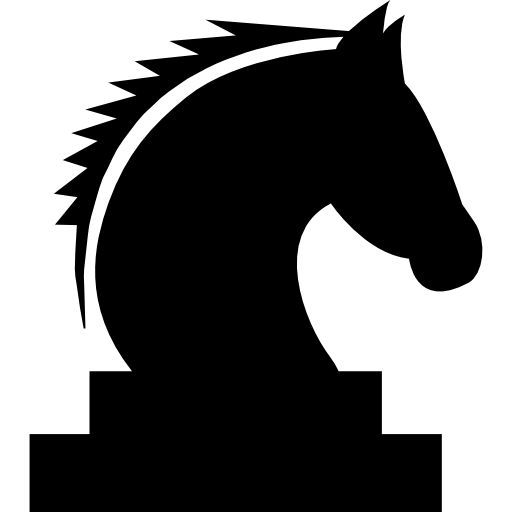

# ♛ Chess

A fully-featured, browser-based chess game built with vanilla HTML, CSS, and JavaScript — no libraries, no frameworks.



## Features

- **Complete rule set**
  - All six piece types with correct movement (pawn, rook, knight, bishop, queen, king)
  - Check & checkmate detection
  - Stalemate detection
  - Castling (kingside & queenside) with rights tracking
  - En passant captures
  - Pawn promotion with a piece-selection modal

- **King safety enforcement** — every move is simulated on a cloned board before being offered; moves that leave the king in check are silently filtered out

- **Turn management** — alternating white/black turns with a live indicator that pulses red when the active player is in check

- **Restart without reload** — the "Play Again" button resets all state in-place; no page refresh, no splash screen re-prompt

- **Premium UI**
  - Dark glassmorphism splash screen with animated gold crown
  - Gold-gradient board frame with coordinate labels
  - Legal-move dot hints and capture-ring highlights
  - End-game modal (checkmate / stalemate) with gold typography
  - Black knight favicon

## Tech Stack

| Layer | Technology |
|---|---|
| Structure | HTML5 |
| Styling | Vanilla CSS (custom properties, animations, glassmorphism) |
| Logic | Vanilla JavaScript ES Modules |
| Fonts | Google Fonts — Cinzel, Montserrat |

## Project Structure

```
Chess/
├── index.html          # App shell, splash overlay, promotion modal
├── style.css           # All styles — board, pieces, modals, animations
├── assets/             # Piece PNGs + background image
└── js/
    ├── main.js         # Game state, interaction loop, check/checkmate/castling/en-passant
    ├── board.js        # boardState array, renderBoard(), resetBoardState()
    ├── pieces.js       # Pseudo-legal move generators for all 6 piece types
    └── utils.js        # Pure helpers — bounds check, colour/type parsing, cloneBoard
```

## Running Locally

No build step needed — just open `index.html` in any modern browser.

```bash
# Option 1: open directly
start index.html

# Option 2: serve with any static server, e.g.
npx serve .
```

## How It Works

Move generation is split into two layers:

1. **Pseudo-legal** (`pieces.js`) — generates all moves a piece *could* make ignoring check
2. **Filtered-legal** (`main.js`) — simulates each pseudo-legal move on a cloned board and discards any that leave the moving side's king in check

This approach naturally prevents capturing the king, enforces check restrictions, and powers checkmate/stalemate detection by checking whether the active player has *any* filtered-legal moves remaining.

---

*Built by MEPHiSTO126*
